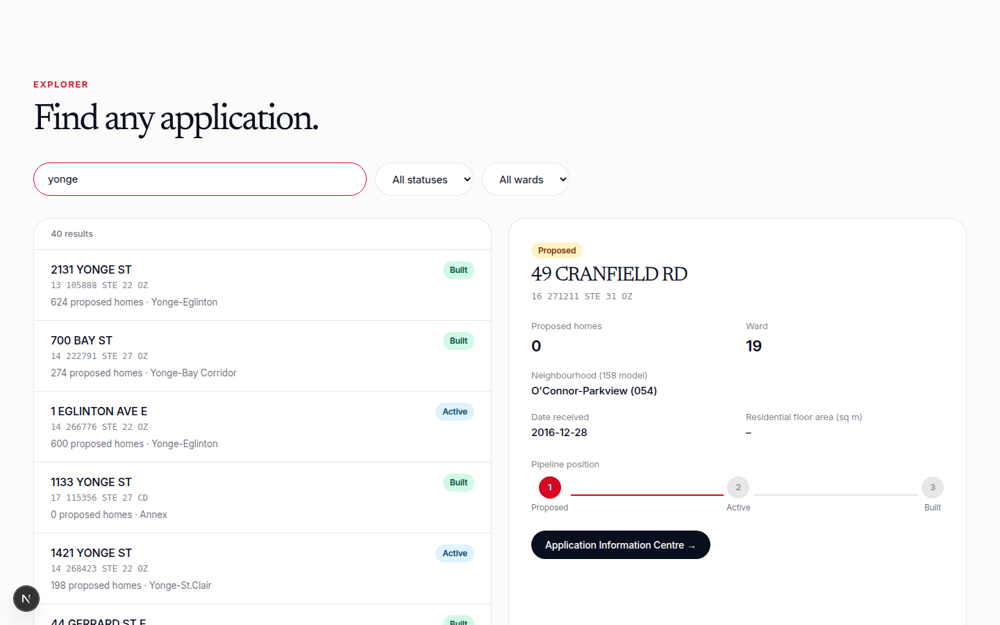
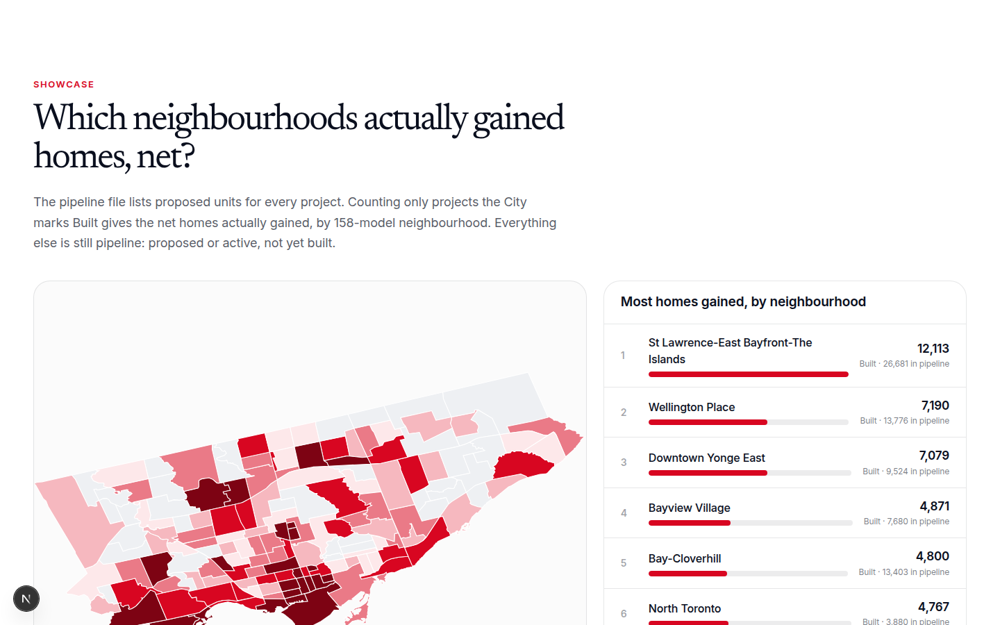
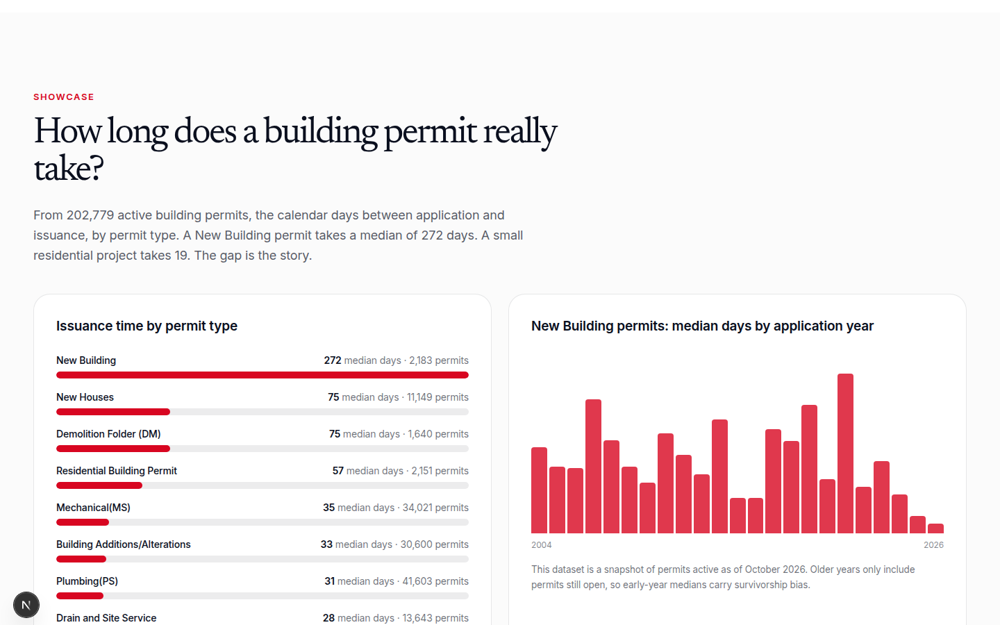

# toronto-development-pipeline

A normalized feed of Toronto's housing development pipeline: which neighbourhoods actually gained homes, net, and how long a building permit really takes. Nshipyard Canada project 08.

City Planning publishes an official Development Pipeline: every large project from application to occupancy, with proposed unit counts. This repo cleans that file, joins it to wards and the 158-model neighbourhood boundaries, applies a normalized status taxonomy (proposed / active / built), and adds building-permit issuance times computed from 202,779 active permits.

An open-source civic project. Not affiliated with the Government of Canada or the City of Toronto.

## Screenshots







## What the data shows

- 124,326 homes sit in projects the City marks Built: the net homes actually gained. Another 803,206 are still pipeline (367,469 proposed, 435,737 active).
- St Lawrence-East Bayfront-The Islands gained the most homes net: 12,113 built, with 26,681 more in its pipeline. Wellington Place follows at 7,190 built.
- A New Building permit takes a median of 272 days from application to issuance. A small residential project takes 19 days. Demolition folders take 75.
- 96.8% of pipeline records matched a development application for coordinates; 96.2% were assigned to a 158-model neighbourhood.

## Files

- `data/pipeline.csv` - 2,391 applications: normalized status, proposed units, ward, 158-model neighbourhood, coordinates
- `data/permit_times.csv` - median issuance days by permit type and year, with p25/p75 (299 type-year rows)
- `data/summary.json` - totals, units by status, built units by neighbourhood, methodology notes
- `data/neighbourhoods_158.json` - simplified 158-model boundaries used for the neighbourhood join
- `data/raw/` - source downloads (kept locally for reproducibility, not committed)

## Status taxonomy

- `proposed` - Under Review in the source: application submitted, decision pending.
- `active` - Active in the source: approved or under construction, not yet recorded complete.
- `built` - Built in the source: completed. Only built units count as homes gained.

## API

- `GET /api/v1/pipeline/search?q=&status=&ward=&limit=` - search applications
- `GET /api/v1/pipeline/lookup/{id}` - one application, e.g. `/api/v1/pipeline/lookup/16%20271211%20STE%2031%20OZ`
- `GET /api/v1/pipeline/summary` - totals and built units by neighbourhood
- `GET /api/v1/pipeline/permit_times?type=&year=` - median issuance days
- `GET /api/openapi.json` - OpenAPI 3.1 spec
- `POST /mcp` - MCP tools over streamable HTTP: `pipeline_search`, `pipeline_summary`, `permit_times`

## Develop

```bash
npm install
npm run dev
```

Rebuild the data (downloads the raw files first):

```bash
python3 scripts/build_pipeline.py
python3 scripts/build_permit_times.py
```

## Methodology notes

Unit counts are proposed units from planning applications, not final occupancy counts. The pipeline covers larger developments requiring Planning Act approvals; as-of-right development below the Site Plan Control threshold is excluded. Permit times are calendar days from application to issuance in the Building Permits Active Permits file, a snapshot of permits active in October 2026, so older years only include permits still open (survivorship bias). Negative values and values over 10 years were excluded as data-entry errors. The City does not publish per-project completion dates or final built unit counts; built status is the closest available proxy for homes gained.

## License

MIT. Source data © City of Toronto (open data); the normalized feed is original work.

## Author

**Richardson Dackam** - [X (@richardsondx)](https://x.com/richardsondx) · [GitHub](https://github.com/richardsondx)
